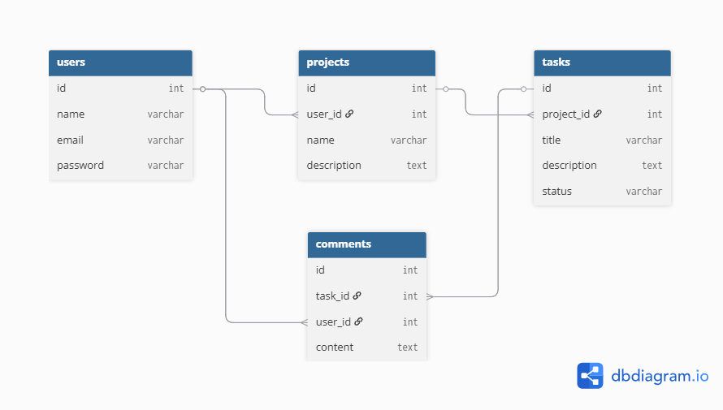

# Task Management API

A RESTful API for managing projects, tasks, and comments.

Built with Laravel 12.

## Features
```bash
- User Authentication (Laravel Sanctum)
- Project management
- Task tracking
- Task comments
- REST API architecture
- Pagination
```

## Tech Stack
```bash
- Laravel 12
- MySQL
- Laravel Sanctum
- REST API
````

## Installation

clone repository
```bash
git clone https://github.com/hadisubhana/task-management-api
```
install dependency
```bash
composer install
```
setup env
```bash
cp .env.example .env
```
generate key
```bash
php artisan key:generate
```
run migration
```bash
php artisan migrate
```
run server
```bash
php artisan serve
```
## API Endpoints

Auth

POST /api/register  
POST /api/login  

Projects

GET /api/projects  
POST /api/projects  
PUT /api/projects/{id}  
DELETE /api/projects/{id}  

Tasks

GET /api/tasks  
POST /api/tasks  
PUT /api/tasks/{id}  
DELETE /api/tasks/{id}  

Comments

POST /api/comments  
GET /api/tasks/{id}/comments  

## Postman Collection

Import files:

docs/Task Management API.postman_collection.json  
docs/Task Management API.postman_environment.json

Then select environment **Task Management API** in Postman.

## Database Diagram


## Author

Hadi Subhana Malik